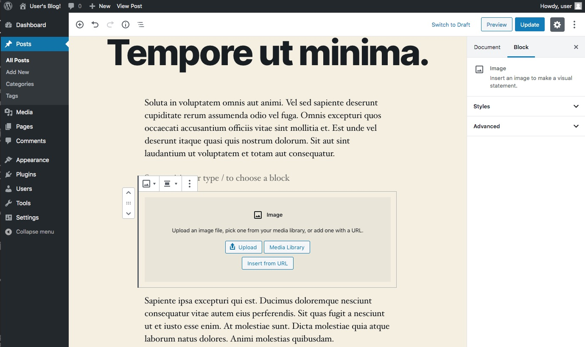

# Kiểm thử ứng dụng WordPress

## Cài đặt

Khởi động Docker container chứa WordPress và MySQL

```shell
$ git clone https://github.com/TechMaster/wordpress_test.git
$ cd wordpress_test
$ docker-compose up -d

Chạy kiểm thử
```shell
$ cd wordpress_test/test
$ npx codeceptjs run --verbose
```

Chú ý script kiểm thử để ở thư mục test/scenario
Chỉ những file nào có đuôi _test.js sẽ được chạy. Cấu hình này được cài đặt trong file test/codecept.conf.js
```tests: './scenario/*_test.js'```

Nếu bạn muốn thêm một kịch bản chạy thì hãy đổi tên file tuân thủ theo định dạng *_test.js và ngược lại

## Yêu cầu bài tập
Hãy bổ xung kiểm thử chèn ảnh vào post

